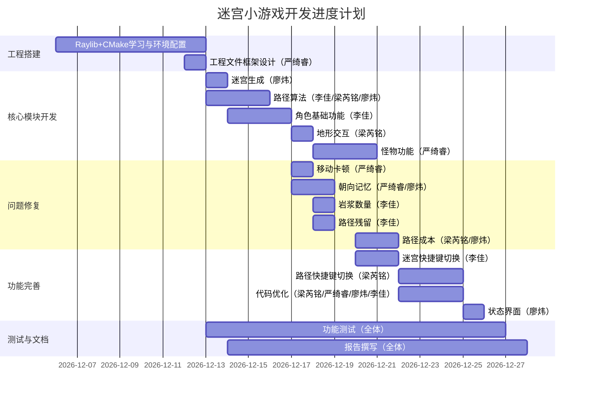

# 任务分析及执行报告

## 一、小组人员及分工

| 姓名 | 角色 | 班级 | 学号 | 分工 |
| --- | --- | --- | --- | --- |
| 廖炜 | 组长 | 24软件工程2班 | 2410321207 | 搭建迷宫雏形、实现两种最短路径、角色重生朝向设置、随机生成迷宫（R键）、更改游戏状态图片（区分两种死亡形式） |
| 李佳 | 组员 | 24软件工程2班 | 2410321215 | 实现深度优先遍历（DFS）、增加角色、解决必经之路岩浆数量问题、解决历史路径残留问题、增加Ctrl+R切换迷宫形式以及Ctrl+Shift+R切回功能 |
| 严绮睿 | 组员 | 24软件工程2班 | 2410321224 | 设计迷宫文件基础框架、解决角色移动卡顿问题、行走动画及移动速度优化、解决角色朝向保留问题、新增怪物相关功能 |
| 梁芮铭 | 组员 | 24软件工程2班 | 2310621220 | 实现广度优先遍历（BFS）、增加草地速度与岩浆死亡机制、解决路径成本问题、完善路径代码、改变路径切换形式、优化整体代码（全组合作） |

## 二、任务分析

1. **所选题目**
迷宫小游戏

2. **拟完成功能**

（1）基础功能
- 图形化渲染：使用 Raylib 加载图片资源，解析迷宫 TXT 文件，可视化展示起点（-1）、终点（-2）、墙（1）、普通地面（0）、草地（2）、熔岩（3）等地块；
- 路径算法可视化：实现 DFS（深度优先）、BFS（广度优先）、Dijkstra 最短路径算法，标注从起点到终点的路径；
- 自定义迷宫测试：设计 20×20 规格的迷宫 TXT 文件，验证所有算法有效性。
（2）进阶功能
- 交互控制：快捷键切换路径显示，方向键控制角色在非墙地块行走；
- 完整游戏流程：设计开始界面（空格键启动）、失败界面（空格键重新开始）、角色起点生成、终点触发胜利提示；
- 高级地块交互：草地行走速度降至原速度 1/3，熔岩地块二次踩中触发游戏失败；
- 高级算法与功能：实现允许踩 1 次熔岩的最短路径算法、随机迷宫生成功能，添加自主行走的敌人 AI ，补完敌人 AI 相关功能。
3. **难点分析**
- 算法与可视化联动：需将 DFS/BFS/Dijkstra 等算法的计算过程，实时映射为 Raylib 的图形标注，避免路径残留或闪烁；
- Raylib 资源与迷宫适配：图片加载、角色精灵动画与迷宫单元格尺寸需精准匹配，确保渲染无错位；
- 地形逻辑冲突处理：草地减速、熔岩伤害等地形规则，需与角色移动、死亡判定逻辑无缝衔接，避免状态异常；
- 随机迷宫生成：需保证生成的迷宫通路连通，同时控制熔岩、草地的分布比例，避免阻塞关键路径；
- 多人协同开发：通过 Git 管理代码时，需避免模块冲突，确保成员提交的代码可兼容整合。
4. **计划实现方案**
采用 “模块化 + 分阶段” 开发策略，结合 Git 协同工作：
- 前期准备：完成 Raylib 配置（CMake 跨平台方案）、Git 环境搭建，学习图算法与 Raylib 绘图 API；
- 核心模块开发：依次实现 “迷宫解析与渲染模块→路径算法模块→角色控制模块→地形交互模块→随机生成与敌人模块”；
- 集成测试：每个模块独立测试通过后，整合为完整系统，调试快捷键、状态切换等联动功能；
- 文档与版本控制：撰写任务报告，定期提交代码至 Git 仓库，最终生成完整日志。
5. **所需数据结构**
- 二维数组：存储迷宫地图数据（地块类型）、角色 / 敌人位置坐标、路径标记矩阵；
- 栈（Stack）：支撑 DFS 算法的递归回溯过程，存储遍历节点；
- 队列（Queue）：实现 BFS 算法的层级遍历，缓存待访问节点；
- 优先队列（Priority Queue）：用于 Dijkstra 算法及熔岩专用最短路径算法，按路径成本排序节点；
- 枚举类型（Enum）：定义游戏状态（开始 / 游戏中 / 胜利 / 失败）、角色朝向（上下左右）、地块类型、算法类型；
- 结构体 / 类（Struct/Class）：封装迷宫（地图数据 + 纹理资源）、角色（位置 + 状态 + 动画）、敌人（巡逻逻辑 + 碰撞检测）等对象；
- 向量（Vector2）：存储 Raylib 中角色、图片的像素坐标，支撑图形渲染与位置计算。

## 三、进度计划



## 四、项目执行日志

### 用户名表：
姓名 | Git用户名
---|---
廖炜| Noviciate111
李佳| shanming222
严绮睿| yan-qiruirui
梁芮铭| Liang20041229

### Git日志：

```bash
* commit e806b6f56b9fdae4d5e8ef7a0b845189bf436f05
| Author: Noviciate111 <3060446814@qq.com>
| Date:   Mon Dec 29 14:19:50 2025 +0800
| 
|     最终成果
| 
* commit 1d12f1a7f57d097a6ab874ba77a97a952131e80c
| Author: Noviciate111 <3060446814@qq.com>
| Date:   Sun Dec 28 01:21:06 2025 +0800
| 
|     更改游戏开始、游戏胜利、游戏失败等图片，区分岩浆死亡和怪物死亡
| 
* commit 4ce181ca6dbda67b261c41b422015a0036765ca0
| Author: Liang20041229 <2157186306@qq.com>
| Date:   Sun Dec 28 00:40:06 2025 +0800
| 
|     完善路径相关代码，改变路径切换方式，优化代码
| 
* commit 3ff7d7c2228d1622b3f554529adbb701f8746db3
| Author: Liang20041229 <2157186306@qq.com>
| Date:   Tue Dec 23 15:21:48 2025 +0800
| 
|     解决路径成本问题
| 
* commit 20dc45a6d9c6fcdf04f223c480ebb6eb5f9ed853
| Author: yan-qiruirui <3207693219@qq.com>
| Date:   Mon Dec 22 20:27:52 2025 +0800
| 
|     新增怪物
| 
* commit 6623cd8331cdf2c61aa18588887074ce37e73a60
| Author: shanming222 <739041220@qq.com>
| Date:   Mon Dec 22 19:59:34 2025 +0800
| 
|     增加了按ctrl+r键切换迷宫形式，ctrl+shift+r切回
| 
* commit 80927d5a17eb320ae72ad722bf4459ebb74ad8b6
| Author: shanming222 <739041220@qq.com>
| Date:   Fri Dec 19 21:05:04 2025 +0800
| 
|     解决必经之路上岩浆数量及历史路径残留问题
| 
* commit 7f47dff4c3b8c385715225429e6913ea03877319
| Author: Noviciate111 <3060446814@qq.com>
| Date:   Fri Dec 19 00:27:45 2025 +0800
| 
|     可通过一次熔岩路径算法和r键随机生成迷宫
| 
* commit 9646c92ef31fb053143f5ba25b5ec224dc7e7f31
| Author: Noviciate111 <3060446814@qq.com>
| Date:   Thu Dec 18 21:28:00 2025 +0800
| 
|     角色起点朝向修正
| 
* commit ae9c491e72ff57d78d1ed6c8548125afe5cf4d35
| Author: Liang20041229 <2157186306@qq.com>
| Date:   Thu Dec 18 15:33:58 2025 +0800
| 
|     补充草地与岩浆相关功能
| 
* commit 733ed7e482fbdcff3f97839e2d4aeb9c7517ca09
| Author: yan-qiruirui <3207693219@qq.com>
| Date:   Wed Dec 17 20:13:54 2025 +0800
| 
|     解决人物朝向问题
| 
* commit 0247be4e98b28a813605684916baaeda874e5714
| Author: yan-qiruirui <3207693219@qq.com>
| Date:   Tue Dec 16 22:48:23 2025 +0800
| 
|     解决角色移动不流畅问题
| 
* commit 6b19152992029d31ee97f09344a7e322a6a81539
| Author: shanming222 <739041220@qq.com>
| Date:   Tue Dec 16 20:41:53 2025 +0800
| 
|     角色
| 
* commit 55218db8b3bb5494464aba9d760983dec659731c
| Author: Noviciate111 <3060446814@qq.com>
| Date:   Tue Dec 16 18:08:32 2025 +0800
| 
|     最短路径
| 
* commit cc60d72c9b86641eb95682516a53b7a50abc3e90
| Author: Liang20041229 <2157186306@qq.com>
| Date:   Tue Dec 16 14:33:31 2025 +0800
| 
|     广度优先遍历
| 
* commit 2d25c50fd28272e005f25bbd82875be4c16f4cf8
| Author: shanming222 <739041220@qq.com>
| Date:   Tue Dec 16 01:18:38 2025 +0800
| 
|     移除远程不必要的build目录
| 
* commit 9242076feb1b1ab7c32436fa83fe7611593da15a
| Author: shanming222 <739041220@qq.com>
| Date:   Tue Dec 16 00:50:30 2025 +0800
| 
|     深度优先遍历
| 
* commit 2ada780b1e193ad7ab564da913fbc4cf93989fcc
| Author: Noviciate111 <3060446814@qq.com>
| Date:   Mon Dec 15 21:21:20 2025 +0800
| 
|     迷宫界面
| 
* commit b70be4b32fe1827ddea5ab059f88ca6ba7fa90b9
| Author: yan-qiruirui <3207693219@qq.com>
| Date:   Mon Dec 15 18:16:08 2025 +0800
| 
|     搭建框架
| 
* commit 5fc08034f2ce811055fe171ff877ef8d05b4a0d1
| Author: Noviciate111 <3060446814@qq.com>
| Date:   Thu Dec 11 00:23:45 2025 +0800
| 
|     基础任务1（学习与练习）
| 
* commit 5963a8444e771093cbbcfc595f658dd36749e27c
  Author: Noviciate111 <3060446814@qq.com>
  Date:   Wed Dec 10 13:46:08 2025 +0800
  
      初始化迷宫游戏项目工程文件

```